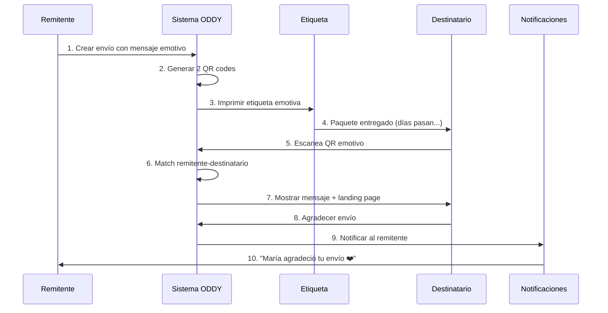

# 💌 Sistema de Etiquetas Emotivas

## 🎯 Concepto

Las **Etiquetas Emotivas** son un sistema innovador que permite a los remitentes enviar **mensajes especiales** a los destinatarios a través de un **QR emotivo**, que puede ser escaneado **incluso 20 días después de la entrega**.

---

## 💡 ¿Cómo Funciona?

### **Problema que Resuelve:**

Cuando envías un regalo y **no es el destinatario quien lo recibe** (ej: lo recibe un portero, familiar, etc.), el destinatario no sabe que hay un mensaje especial para él.

### **Solución: Etiqueta Emotiva**

1. **Remitente** crea un envío con un mensaje especial
2. La etiqueta tiene **2 QR codes:**
   - **QR Tracking:** Para seguimiento normal del paquete
   - **QR Emotivo:** Para el mensaje especial (destacado)
3. **Destinatario** recibe el paquete y ve el QR emotivo
4. **Escanea el QR** (puede ser días después)
5. **Ve el mensaje** del remitente (texto, imagen, video)
6. **Puede agradecer** desde ahí mismo
7. **Remitente recibe notificación** del agradecimiento

---

## 🎨 Diseño de Etiqueta Emotiva

```
┌────────────────────────────────────────────────────────────┐
│  Juan Pérez                                                │
│  para María González                                       │
│  ──────────────────────────────────────────────────────    │
│                                                            │
│  PARA:                                                     │
│  María González                                            │
│  Calle Falsa 456, Buenos Aires, Argentina                 │
│                                                            │
│  TRACKING: PKG-12345                                       │
│                                                            │
│  [QR Tracking]              ┌─────────────────────┐       │
│  Escanea para               │  [QR EMOTIVO]       │       │
│  tracking                   │   MÁS GRANDE        │       │
│                             │                     │       │
│                             │   MENSAJE           │       │
│                             │   ESPECIAL          │       │
│                             │   Escanea aquí ❤️   │       │
│                             └─────────────────────┘       │
│                                                            │
│  💌 ¡Tienes un mensaje especial esperándote!              │
│                                                            │
└────────────────────────────────────────────────────────────┘
```

---

## 📋 Flujo Completo



---

## 🚀 Endpoints del Sistema

### **1. Generar Etiqueta Emotiva**

```http
POST /make-server-0dd48dc4/labels/emotive/generate
```

**Request:**
```json
{
  "entity_id": "default",
  "format": {"width": 100, "height": 150, "name": "Envío"},
  
  "package": {
    "tracking_number": "PKG-12345",
    "order_id": "order:123",
    "weight": "2.5kg",
    "dimensions": "30x20x10cm"
  },
  
  "sender": {
    "party_id": "party:juan",
    "name": "Juan Pérez",
    "phone": "+598 99 123 456",
    "email": "juan@email.com",
    "address": "Av. Principal 123, Montevideo"
  },
  
  "recipient": {
    "party_id": "party:maria",
    "name": "María González",
    "phone": "+54 11 1234 5678",
    "email": "maria@email.com",
    "address": "Calle Falsa 456, Buenos Aires"
  },
  
  "emotive_message": {
    "title": "¡Feliz Cumpleaños, María!",
    "message": "Espero que este regalo te traiga tanta alegría como tú me traes a mí cada día. Te quiero mucho. ❤️",
    "image_url": "https://example.com/birthday.jpg",
    "video_url": "https://example.com/birthday-video.mp4",
    "sender_signature": "Con todo mi cariño, Juan",
    "reveal_on_scan": true
  },
  
  "base_url": "https://oddy.market"
}
```

**Response:**
```json
{
  "emotive_label": {
    "id": "emotive:1707735000000",
    "entity_id": "default",
    "label_type": "emotive",
    "package": { "tracking_number": "PKG-12345", ... },
    "sender": { "name": "Juan Pérez", ... },
    "recipient": { "name": "María González", ... },
    "emotive_message": { "title": "¡Feliz Cumpleaños, María!", ... },
    "qr_tracking": {
      "type": "tracking",
      "url": "https://oddy.market/track/PKG-12345",
      "scanned": false
    },
    "qr_emotive": {
      "type": "emotive",
      "url": "https://oddy.market/emotive/emotive:1707735000000",
      "scanned": false
    },
    "match": {
      "matched": false,
      "recipient_acknowledged": false
    },
    "status": "pending",
    "created_at": "2026-02-12T10:00:00Z"
  },
  "message": "Emotive label generated successfully",
  "qr_codes": {
    "tracking": {
      "url": "https://oddy.market/track/PKG-12345",
      "svg": "<svg>...</svg>"
    },
    "emotive": {
      "url": "https://oddy.market/emotive/emotive:1707735000000",
      "svg": "<svg>...</svg>"
    }
  },
  "printer_data": {
    "format": "TSPL",
    "commands": [...]
  }
}
```

---

### **2. Escanear QR Emotivo (Landing Page)**

```http
GET /make-server-0dd48dc4/emotive/:id/scan
```

**Parámetros:**
- `:id` - ID de la etiqueta emotiva (ej: `emotive:1707735000000`)

**Response:**
```json
{
  "success": true,
  "emotive_label": {
    "id": "emotive:1707735000000",
    "package": {
      "tracking_number": "PKG-12345"
    },
    "sender": {
      "name": "Juan Pérez"
    },
    "recipient": {
      "name": "María González"
    },
    "emotive_message": {
      "title": "¡Feliz Cumpleaños, María!",
      "message": "Espero que este regalo te traiga tanta alegría como tú me traes a mí cada día. Te quiero mucho. ❤️",
      "image_url": "https://example.com/birthday.jpg",
      "video_url": "https://example.com/birthday-video.mp4",
      "sender_signature": "Con todo mi cariño, Juan"
    },
    "delivered_at": "2026-01-15T10:00:00Z",
    "days_since_delivery": 28
  },
  "can_acknowledge": true
}
```

**Uso:**
Este endpoint se llama cuando el destinatario escanea el QR emotivo. Retorna los datos para mostrar una landing page hermosa con el mensaje.

---

### **3. Agradecer el Envío**

```http
POST /make-server-0dd48dc4/emotive/:id/acknowledge
```

**Request:**
```json
{
  "thank_you_message": "¡Muchas gracias, Juan! Me encantó el regalo. Eres el mejor hermano del mundo. ❤️"
}
```

**Response:**
```json
{
  "success": true,
  "message": "Thank you message sent successfully!",
  "emotive_label": {
    "sender": { "name": "Juan Pérez" },
    "recipient": { "name": "María González" },
    "acknowledged_at": "2026-02-12T15:30:00Z"
  }
}
```

**Efecto:**
- Se registra el agradecimiento
- Se envía notificación al remitente (email, SMS, push)
- El remitente puede ver el mensaje de agradecimiento

---

### **4. Obtener Etiqueta Emotiva**

```http
GET /make-server-0dd48dc4/emotive/:id
```

**Response:**
```json
{
  "emotive_label": {
    "id": "emotive:1707735000000",
    "package": { ... },
    "sender": { ... },
    "recipient": { ... },
    "emotive_message": { ... },
    "qr_tracking": { ... },
    "qr_emotive": { ... },
    "match": {
      "matched": true,
      "matched_at": "2026-02-12T15:00:00Z",
      "recipient_acknowledged": true,
      "acknowledged_at": "2026-02-12T15:30:00Z",
      "thank_you_message": "¡Muchas gracias! ❤️"
    },
    "status": "acknowledged",
    "interactions": [
      {
        "type": "qr_emotive_scanned",
        "timestamp": "2026-02-12T15:00:00Z"
      },
      {
        "type": "recipient_acknowledged",
        "timestamp": "2026-02-12T15:30:00Z",
        "message": "¡Muchas gracias! ❤️"
      }
    ]
  }
}
```

---

### **5. Listar Etiquetas Emotivas**

```http
GET /make-server-0dd48dc4/emotive?entity_id=default
GET /make-server-0dd48dc4/emotive?sender_id=party:juan
GET /make-server-0dd48dc4/emotive?recipient_id=party:maria
GET /make-server-0dd48dc4/emotive?status=revealed
```

**Response:**
```json
{
  "emotive_labels": [
    { "id": "emotive:1", ... },
    { "id": "emotive:2", ... }
  ],
  "total": 2
}
```

---

### **6. Dashboard de Estadísticas**

```http
GET /make-server-0dd48dc4/emotive/stats/dashboard?entity_id=default
```

**Response:**
```json
{
  "stats": {
    "total": 150,
    "by_status": {
      "pending": 10,
      "shipped": 20,
      "delivered": 50,
      "revealed": 40,
      "acknowledged": 30
    },
    "qr_scans": {
      "tracking": 120,
      "emotive": 70
    },
    "matches": {
      "total": 70,
      "acknowledged": 30,
      "pending": 40
    },
    "avg_days_to_reveal": 5,
    "avg_days_to_acknowledge": 2
  }
}
```

**Interpretación:**
- **avg_days_to_reveal:** Promedio de días entre entrega y escaneo del QR emotivo
- **avg_days_to_acknowledge:** Promedio de días entre entrega y agradecimiento

---

### **7. Actualizar Estado (Integración con Sistema de Última Milla)**

```http
POST /make-server-0dd48dc4/emotive/:id/update-status
```

**Request:**
```json
{
  "status": "delivered",
  "delivered_to": "Portero del edificio",
  "tracking_update": {
    "location": "Buenos Aires, Argentina",
    "timestamp": "2026-02-12T10:00:00Z",
    "notes": "Entregado exitosamente"
  }
}
```

**Response:**
```json
{
  "success": true,
  "message": "Status updated successfully",
  "emotive_label": { ... }
}
```

**Uso:**
Este endpoint debe ser llamado por tu sistema de última milla cuando:
- El paquete es enviado (`status: "shipped"`)
- El paquete es entregado (`status: "delivered"`)

---

## 🎯 Casos de Uso

### **Caso 1: Regalo de Cumpleaños**

**Escenario:**
- Juan envía un regalo de cumpleaños a su hermana María
- María vive en Buenos Aires, Juan en Montevideo
- El paquete lo recibe el portero del edificio

**Flujo:**
1. Juan crea el envío con mensaje: "¡Feliz Cumpleaños, hermanita!"
2. Se genera etiqueta emotiva con 2 QR
3. Paquete enviado y entregado al portero (María no se entera)
4. **3 días después**, María encuentra el paquete y ve el QR emotivo destacado
5. Escanea el QR y ve el mensaje de Juan + foto + video
6. María agradece: "¡Gracias, Juan! Eres el mejor hermano ❤️"
7. Juan recibe notificación: "María agradeció tu envío hace 3 minutos"

---

### **Caso 2: Regalo de Aniversario**

**Escenario:**
- Carlos envía flores a su esposa para el aniversario
- Las flores llegan cuando ella no está en casa (las recibe un vecino)

**Flujo:**
1. Carlos incluye mensaje: "10 años juntos y te amo más cada día"
2. **20 días después** (sí, 20 días!), ella encuentra la tarjeta con el QR emotivo
3. Escanea y revive el mensaje emotivo
4. Agradece: "Nunca pensé que después de 20 días volvería a emocionarme con esto"
5. Carlos recibe la notificación y sonríe

---

### **Caso 3: Regalo Sorpresa**

**Escenario:**
- Abuela envía regalo a su nieto universitario
- El nieto vive en residencia estudiantil

**Flujo:**
1. Abuela escribe: "Para mi nieto favorito, que siempre me hace orgullosa"
2. Paquete llega a la residencia, lo recibe el conserje
3. **1 semana después**, el nieto lo reclama y ve el QR emotivo
4. Escanea y ve el mensaje + foto de la abuela
5. Agradece: "Te amo, abuela. Gracias por siempre estar ahí"
6. Abuela recibe notificación y llora de felicidad ❤️

---

## 💻 Landing Page Sugerida

Cuando el destinatario escanea el QR emotivo, debe ver una landing page hermosa:

```html
<!DOCTYPE html>
<html>
<head>
  <title>Mensaje Especial de Juan</title>
  <style>
    body {
      font-family: 'Arial', sans-serif;
      background: linear-gradient(135deg, #667eea 0%, #764ba2 100%);
      color: white;
      text-align: center;
      padding: 20px;
    }
    .container {
      max-width: 600px;
      margin: 0 auto;
      background: white;
      color: #333;
      border-radius: 20px;
      padding: 40px;
      box-shadow: 0 20px 60px rgba(0,0,0,0.3);
    }
    .title {
      font-size: 32px;
      font-weight: bold;
      margin-bottom: 20px;
      color: #667eea;
    }
    .message {
      font-size: 18px;
      line-height: 1.6;
      margin: 30px 0;
    }
    .sender {
      font-style: italic;
      color: #764ba2;
      margin-top: 30px;
    }
    .thank-you {
      margin-top: 40px;
      padding: 20px;
      background: #f8f9fa;
      border-radius: 10px;
    }
    button {
      background: #667eea;
      color: white;
      border: none;
      padding: 15px 40px;
      font-size: 18px;
      border-radius: 50px;
      cursor: pointer;
      margin-top: 20px;
    }
    button:hover {
      background: #764ba2;
    }
  </style>
</head>
<body>
  <div class="container">
    <h1 class="title">💌 ¡Tienes un mensaje especial!</h1>
    
    <p><strong>De:</strong> Juan Pérez</p>
    <p><strong>Para:</strong> María González</p>
    
    <div class="message">
      <h2>¡Feliz Cumpleaños, María!</h2>
      <p>Espero que este regalo te traiga tanta alegría como tú me traes a mí cada día. Te quiero mucho. ❤️</p>
      
      
      
      <p class="sender">Con todo mi cariño, Juan</p>
    </div>
    
    <div class="thank-you">
      <h3>¿Quieres agradecer?</h3>
      <textarea id="thankYouMessage" placeholder="Escribe tu mensaje de agradecimiento..." style="width: 100%; height: 100px; padding: 10px; border-radius: 10px; border: 1px solid #ddd;"></textarea>
      <button onclick="sendThankYou()">Enviar Agradecimiento ❤️</button>
    </div>
    
    <p style="margin-top: 30px; font-size: 14px; color: #999;">
      Entregado hace 28 días • PKG-12345
    </p>
  </div>
  
  <script>
    async function sendThankYou() {
      const message = document.getElementById('thankYouMessage').value;
      if (!message) {
        alert('Por favor escribe un mensaje');
        return;
      }
      
      const response = await fetch('/emotive/emotive:123/acknowledge', {
        method: 'POST',
        headers: { 'Content-Type': 'application/json' },
        body: JSON.stringify({ thank_you_message: message })
      });
      
      if (response.ok) {
        alert('¡Mensaje enviado! Juan recibirá una notificación ❤️');
        document.querySelector('.thank-you').innerHTML = '<h3>✅ ¡Mensaje enviado exitosamente!</h3>';
      }
    }
  </script>
</body>
</html>
```

---

## 📊 Estadísticas del Sistema

| Métrica | Valor |
|---------|-------|
| **Nuevos endpoints** | +7 |
| **Líneas agregadas** | ~400 |
| **Estados posibles** | 5 (pending, shipped, delivered, revealed, acknowledged) |
| **QR codes por etiqueta** | 2 (tracking + emotivo) |
| **Tipos de interacciones** | 3 (scan, acknowledge, delivery) |

---

## 🔗 Integración con Sistema de Última Milla

Tu sistema de última milla debe llamar al endpoint de actualización de estado:

```javascript
// Cuando el paquete es enviado
await updateEmotiveStatus(emotive_id, {
  status: "shipped"
});

// Cuando el paquete es entregado
await updateEmotiveStatus(emotive_id, {
  status: "delivered",
  delivered_to: "Portero del edificio"
});
```

---

## ✅ Ventajas del Sistema

1. **Emotivo:** Conecta remitente y destinatario de forma especial
2. **Diferido:** Funciona incluso 20+ días después
3. **Match automático:** No requiere registro previo
4. **Notificaciones:** El remitente sabe cuándo se agradeció
5. **Analítica:** Estadísticas de engagement
6. **Único:** No existe nada igual en el mercado

---

## 🚀 Próximos Pasos

### **Frontend:**
1. Landing page hermosa para QR emotivo
2. Dashboard para remitentes (ver agradecimientos)
3. Editor de mensajes emotivos (texto, imagen, video)
4. Notificaciones push en tiempo real

### **Backend:**
1. Notificaciones por email/SMS al remitente
2. Plantillas de mensajes emotivos
3. Integración con storage para imágenes/videos
4. Analytics avanzados

---

## 💡 Ideas Adicionales

1. **Mensajes con Audio:** Permitir grabar un mensaje de voz
2. **Mensajes Programados:** Revelar el mensaje en una fecha específica
3. **Mensajes Grupales:** Varios remitentes pueden contribuir
4. **Respuestas Multimedia:** El destinatario puede responder con foto/video
5. **Gamificación:** Badges por cantidad de agradecimientos recibidos

---

**¡Sistema de Etiquetas Emotivas listo para hacer llorar de emoción! 💌❤️**
