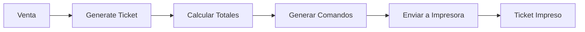
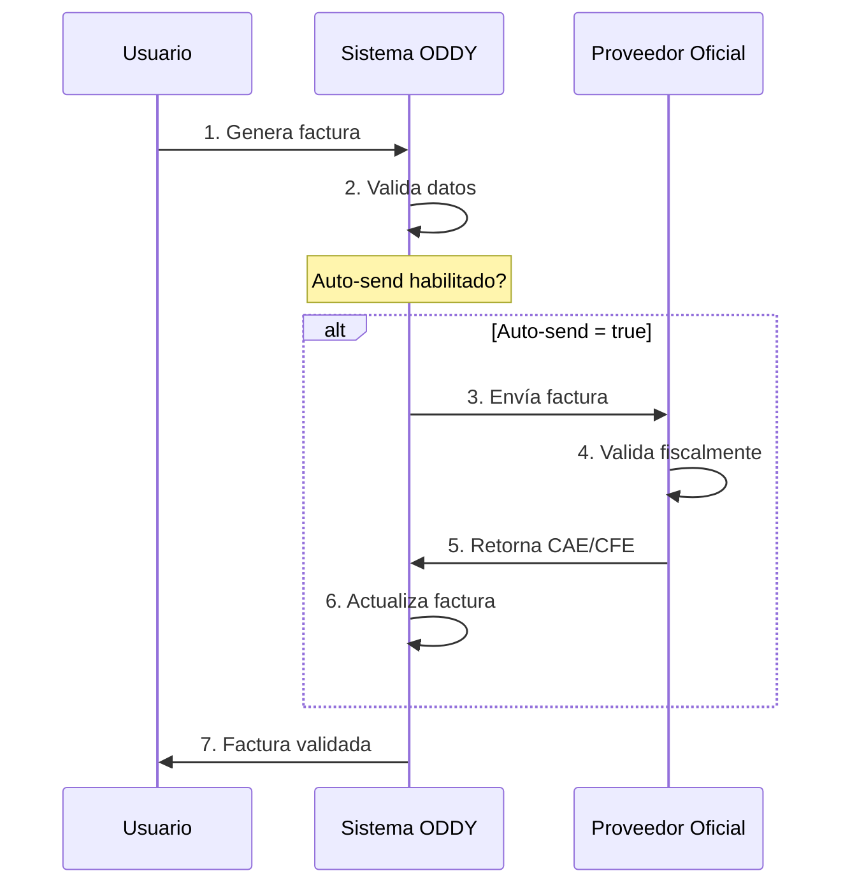

# 🎯 Visualización: Mejoras en documents.tsx

## 📊 Antes vs Después

### **ANTES (documents.tsx original):**
```
✅ 9 tipos de documentos
✅ 15 endpoints
✅ ~950 líneas
✅ PDF generation
✅ Email sending
✅ Numeración automática
```

### **DESPUÉS (documents.tsx mejorado):**
```
✅ 10 tipos de documentos (+TICKET)
✅ 21 endpoints (+6 nuevos)
✅ ~1,170 líneas (+220)
✅ PDF generation
✅ Email sending
✅ Numeración automática
🆕 TICKETERA (impresora térmica)
🆕 DASHBOARD DE DOCUMENTOS POR PARTY
🆕 E-INVOICE (8 países de Latam)
🆕 MIS DOCUMENTOS (acceso directo)
```

---

## 🎫 1. TICKETERA (IMPRESORA TÉRMICA)

### **Flujo:**



### **Salida de Ticket:**

```
═══════════════════════════════
       [LOGO ODDY MARKET]
═══════════════════════════════

         ODDY Market
      Av. Principal 123
     Montevideo, Uruguay

═══════════════════════════════
  TICKET: T-00001
  FECHA: 12/02/2026 10:30:00
═══════════════════════════════

Camiseta Deportiva x2   $244.00
Pantalón Jeans x1       $305.00

───────────────────────────────
                 SUBTOTAL: $450
                 IVA (22%): $99
───────────────────────────────
                    TOTAL: $549
───────────────────────────────

        Gracias por su compra

          [QR CODE]

═══════════════════════════════
          - CORTE -
```

### **Formato de Comandos:**

```json
{
  "thermal_data": {
    "width": 58,
    "commands": [
      "ALIGN CENTER",
      "LOGO",
      "TEXT BOLD ON",
      "TEXT ODDY Market",
      "TEXT BOLD OFF",
      "LINE",
      "TEXT TICKET: T-00001",
      "TEXT FECHA: 12/02/2026 10:30:00",
      "LINE",
      "ALIGN LEFT",
      "TEXT Camiseta Deportiva x2 $244",
      "TEXT Pantalón Jeans x1 $305",
      "LINE",
      "ALIGN RIGHT",
      "TEXT BOLD ON",
      "TEXT TOTAL: $549",
      "TEXT BOLD OFF",
      "LINE",
      "ALIGN CENTER",
      "TEXT Gracias por su compra",
      "QR doc:1234567890",
      "CUT"
    ]
  }
}
```

---

## 📊 2. DASHBOARD DE DOCUMENTOS POR PARTY

### **Vista del Dashboard:**

```
╔══════════════════════════════════════════════════════════════╗
║              DASHBOARD - Carlos González                    ║
╠══════════════════════════════════════════════════════════════╣
║                                                              ║
║  📄 RESUMEN DE DOCUMENTOS                                    ║
║  ────────────────────────────────────────                   ║
║  Total:              45 documentos                          ║
║  Cotizaciones:       12                                     ║
║  Facturas:           20                                     ║
║  Tickets:            10                                     ║
║  Remitos:            3                                      ║
║                                                              ║
║  💰 RESUMEN FINANCIERO                                       ║
║  ────────────────────────────────────────                   ║
║  Total Facturado:    $50,000                                ║
║  Total Pagado:       $35,000                                ║
║  Total Pendiente:    $15,000                                ║
║                                                              ║
║  📋 DOCUMENTOS RECIENTES                                     ║
║  ────────────────────────────────────────                   ║
║  [A-00045] Factura    $1,200  [PAID]     📄 PDF            ║
║  [T-00123] Ticket       $549  [PAID]                        ║
║  [Q-00089] Cotización $2,500  [SENT]     📄 PDF            ║
║  [A-00044] Factura    $3,200  [PENDING]  📄 PDF            ║
║  ...                                                         ║
╚══════════════════════════════════════════════════════════════╝
```

### **Endpoint:**
```
GET /documents/party/:party_id/dashboard?entity_id=xxx
```

---

## 🌎 3. E-INVOICE (8 PAÍSES DE LATAM)

### **Mapa de Proveedores:**

```
┌─────────────────────────────────────────────────────────┐
│                                                         │
│   🇲🇽 MÉXICO        🇨🇴 COLOMBIA      🇪🇨 ECUADOR        │
│   SAT              DIAN              SRI               │
│                                                         │
│   🇵🇪 PERÚ          🇧🇷 BRASIL         🇨🇱 CHILE          │
│   SUNAT            SEFAZ             SII               │
│                                                         │
│   🇦🇷 ARGENTINA     🇺🇾 URUGUAY                          │
│   AFIP             DGI                                 │
│                                                         │
└─────────────────────────────────────────────────────────┘
```

### **Flujo de Facturación Electrónica:**



### **Ejemplo de Validación:**

```json
{
  "fiscal_validation": {
    "validated": true,
    "validation_date": "2026-02-12T10:00:00Z",
    "cfe": "CFE-1707735200000",
    "validation_code": "UY-1707735200000-abc123",
    "provider": "dgi",
    "environment": "testing"
  }
}
```

---

## 🔐 4. CONFIGURACIÓN DE E-INVOICE

### **Panel de Configuración:**

```
╔════════════════════════════════════════════════════════╗
║     CONFIGURACIÓN FACTURACIÓN ELECTRÓNICA             ║
╠════════════════════════════════════════════════════════╣
║                                                        ║
║  País:              🇺🇾 Uruguay                         ║
║  Proveedor:         DGI                                ║
║  Endpoint:          https://seace.dgi.gub.uy           ║
║                                                        ║
║  ┌──────────────────────────────────────────────────┐ ║
║  │ CREDENCIALES                                     │ ║
║  ├──────────────────────────────────────────────────┤ ║
║  │ RUT:          123456789012                       │ ║
║  │ Certificado:  [CARGADO] ✓                        │ ║
║  │ Clave:        [CARGADA] ✓                        │ ║
║  │ Usuario:      ODDY_USER                          │ ║
║  │ Contraseña:   ••••••••••                         │ ║
║  └──────────────────────────────────────────────────┘ ║
║                                                        ║
║  Ambiente:          [x] Testing  [ ] Production        ║
║  Envío automático:  [x] Habilitado                     ║
║  Estado:            [x] Activo                         ║
║                                                        ║
║              [GUARDAR]     [CANCELAR]                  ║
║                                                        ║
╚════════════════════════════════════════════════════════╝
```

---

## 📄 5. MIS DOCUMENTOS (ACCESO DIRECTO)

### **Vista del Cliente:**

```
╔════════════════════════════════════════════════════════╗
║                MIS DOCUMENTOS                          ║
╠════════════════════════════════════════════════════════╣
║                                                        ║
║  [A-00045] Factura                   12/02/2026       ║
║  Total: $1,200                       [PAGADA] ✓       ║
║  📄 [Descargar PDF]  🔗 [Ver online]                  ║
║  ━━━━━━━━━━━━━━━━━━━━━━━━━━━━━━━━━━━━━━━━━━━━━━━━━━  ║
║                                                        ║
║  [T-00123] Ticket                    12/02/2026       ║
║  Total: $549                         [PAGADO] ✓       ║
║  🔗 [Ver online]                                      ║
║  ━━━━━━━━━━━━━━━━━━━━━━━━━━━━━━━━━━━━━━━━━━━━━━━━━━  ║
║                                                        ║
║  [Q-00089] Cotización                10/02/2026       ║
║  Total: $2,500                       [ENVIADA] 📧     ║
║  📄 [Descargar PDF]  🔗 [Ver online]                  ║
║  ━━━━━━━━━━━━━━━━━━━━━━━━━━━━━━━━━━━━━━━━━━━━━━━━━━  ║
║                                                        ║
║  [A-00044] Factura                   08/02/2026       ║
║  Total: $3,200                       [PENDIENTE] ⚠    ║
║  Vencimiento: 08/03/2026                              ║
║  📄 [Descargar PDF]  🔗 [Ver online]  💳 [Pagar]      ║
║                                                        ║
╚════════════════════════════════════════════════════════╝
```

### **Endpoint:**
```
GET /documents/my-documents?party_id=xxx&entity_id=xxx
```

---

## 📈 COMPARACIÓN DE ENDPOINTS

### **Nuevos Endpoints Agregados:**

| # | Endpoint | Método | Descripción |
|---|----------|--------|-------------|
| 1 | `/documents/party/:party_id/dashboard` | GET | Dashboard de documentos por party |
| 2 | `/documents/generate-ticket` | POST | Generar ticket para impresora térmica |
| 3 | `/documents/e-invoice/providers` | GET | Listar proveedores de e-invoice |
| 4 | `/documents/e-invoice/configure` | POST | Configurar credenciales de e-invoice |
| 5 | `/documents/e-invoice/config` | GET | Obtener configuración de e-invoice |
| 6 | `/documents/:id/submit-to-provider` | POST | Enviar documento a proveedor oficial |
| 7 | `/documents/my-documents` | GET | Listar documentos accesibles para party |

---

## 🎯 CASOS DE USO

### **Caso 1: Punto de Venta**

```
1. Cliente compra productos
2. Sistema genera ticket
3. Impresora térmica imprime
4. Cliente recibe ticket físico
5. Ticket queda registrado en dashboard
```

### **Caso 2: Facturación Electrónica**

```
1. Empresa genera factura
2. Sistema valida datos
3. Envío automático a DGI/AFIP/SAT
4. Proveedor valida y retorna CFE/CAE
5. Factura queda validada fiscalmente
6. Cliente recibe factura por email
7. Cliente puede descargar desde "Mis Documentos"
```

### **Caso 3: Dashboard del Cliente**

```
1. Cliente inicia sesión
2. Accede a "Mis Documentos"
3. Ve todas sus facturas, tickets, cotizaciones
4. Descarga PDFs
5. Paga facturas pendientes
6. Ve histórico completo
```

---

## 🔢 ESTADÍSTICAS DE MEJORAS

```
┌─────────────────────────────────────────┐
│  MÓDULO: documents.tsx                  │
├─────────────────────────────────────────┤
│  Líneas agregadas:     +220             │
│  Endpoints agregados:  +6               │
│  Tipos de doc nuevos:  +1 (TICKET)      │
│  Países soportados:    8                │
│  Proveedores:          8                │
├─────────────────────────────────────────┤
│  Total endpoints:      21               │
│  Total líneas:         ~1,170           │
│  Estado:               ✅ COMPLETADO     │
└─────────────────────────────────────────┘
```

---

## ✅ CHECKLIST DE FUNCIONALIDADES

### **Documentos Base:**
- [x] Cotización/Presupuesto
- [x] Factura
- [x] Nota de crédito
- [x] Nota de débito
- [x] Orden de compra
- [x] Remito/Guía de envío
- [x] Carta de porte
- [x] Recibo
- [x] Factura proforma
- [x] **TICKET (nuevo)**

### **Ticketera:**
- [x] Formato 58mm
- [x] Formato 80mm
- [x] Logo opcional
- [x] QR opcional
- [x] Comandos de impresora
- [x] Numeración automática (serie T)

### **E-Invoice:**
- [x] Uruguay (DGI)
- [x] Argentina (AFIP)
- [x] Brasil (SEFAZ)
- [x] Chile (SII)
- [x] Perú (SUNAT)
- [x] México (SAT)
- [x] Colombia (DIAN)
- [x] Ecuador (SRI)
- [x] Configuración de credenciales
- [x] Envío automático
- [x] Validación fiscal

### **Dashboard:**
- [x] Resumen de documentos
- [x] Resumen financiero
- [x] Documentos recientes
- [x] Acceso por party
- [x] Estadísticas

### **Mis Documentos:**
- [x] Listar documentos
- [x] Filtrar por tipo
- [x] Ordenar por fecha
- [x] Descargar PDF
- [x] Ver estado fiscal

---

## 🚀 IMPACTO

### **Antes:**
- ❌ No había tickets
- ❌ No había dashboard por cliente
- ❌ No había integración con proveedores oficiales
- ❌ No había acceso directo para clientes

### **Después:**
- ✅ Ticketera completa
- ✅ Dashboard completo por cliente
- ✅ 8 países de Latam soportados
- ✅ Acceso directo para clientes
- ✅ Validación fiscal automática
- ✅ Cumplimiento normativo

---

## 💡 PRÓXIMOS PASOS SUGERIDOS

### **Frontend:**
1. Componente de ticketera con vista previa en tiempo real
2. Dashboard de documentos del cliente (panel)
3. Configuración de e-invoice (admin)
4. Conexión a impresora USB/Network

### **Backend:**
1. Integración real con APIs de proveedores
2. Firma digital de documentos
3. Generación de XML según formato de cada país
4. Webhooks de proveedores
5. Encriptación de credenciales en BD

---

**¡Sistema de documentos profesional listo para producción!** 🎉
