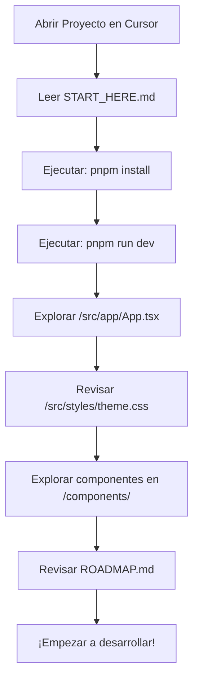

# 🎨 ODDY Market - Guía Visual de Archivos

```
📦 ODDY-MARKET/
│
├── 🚀 EMPEZAR AQUÍ
│   ├── START_HERE.md                    ⭐ EMPIEZA AQUÍ - Índice principal
│   ├── CURSOR_START.md                  ⚡ Guía rápida 3 pasos
│   └── BIENVENIDA.md                    🎉 Bienvenida con ASCII art
│
├── 📚 DOCUMENTACIÓN PRINCIPAL  
│   ├── README.md                        📖 Documentación completa
│   ├── RESUMEN_EJECUTIVO.md             📋 Estado y roadmap
│   ├── ESTRUCTURA_PROYECTO.md           🗂️ Mapa de archivos
│   ├── ARCHIVOS_CREADOS.md              📄 Cambios realizados
│   └── CHECKLIST_FINAL.md               ✅ Verificación completa
│
├── ⚙️ CONFIGURACIÓN CURSOR
│   ├── .cursorrules                     🤖 Reglas para Cursor AI
│   ├── .vscode/
│   │   ├── settings.json                ⚙️ Configuración IDE
│   │   └── extensions.json              🧩 Extensiones recomendadas
│   ├── .prettierrc                      ✨ Formato de código
│   └── .gitignore                       🚫 Archivos ignorados
│
├── 🎨 CÓDIGO FUENTE
│   └── src/
│       ├── app/
│       │   ├── App.tsx                  ⭐ COMPONENTE PRINCIPAL
│       │   │
│       │   ├── components/
│       │   │   ├── Header.tsx           🎨 Header con logo ODDY
│       │   │   ├── HomePage.tsx         🏠 Página de inicio
│       │   │   ├── Cart.tsx             🛒 Carrito de compras
│       │   │   ├── Checkout.tsx         💳 Proceso de pago
│       │   │   ├── AdminDashboard.tsx   👨‍💼 Panel admin
│       │   │   │
│       │   │   └── ui/                  🧩 45+ Componentes UI
│       │   │       ├── button.tsx
│       │   │       ├── card.tsx
│       │   │       ├── dialog.tsx
│       │   │       └── ... (42 más)
│       │   │
│       │   └── utils/
│       │       └── billing-helper.ts    🧾 Helpers facturación
│       │
│       ├── styles/
│       │   ├── theme.css                🎨 Tokens de diseño
│       │   ├── index.css                📝 Estilos globales
│       │   └── tailwind.css             💨 Tailwind v4
│       │
│       └── main.tsx                     🚀 Punto de entrada
│
├── 🔧 BACKEND
│   └── supabase/functions/server/
│       ├── index.tsx                    🌐 Servidor Hono
│       ├── billing.tsx                  🧾 API Facturación
│       ├── integrations.tsx             💳 API Pagos
│       └── kv_store.tsx                 💾 Base de datos
│
├── 📚 DOCS TÉCNICA
│   └── docs/
│       ├── BILLING_SYSTEM.md            🧾 Sistema facturación
│       ├── PAYMENT_INTEGRATIONS_SUMMARY.md 💳 Integraciones
│       ├── PLEXO_INTEGRATION.md         🇺🇾 Plexo Uruguay
│       └── ... (6 docs más)
│
├── 🎬 SCRIPTS
│   ├── start.sh                         🐧 Script Linux/Mac
│   └── start.bat                        🪟 Script Windows
│
└── ⚙️ CONFIGURACIÓN
    ├── package.json                     📦 Dependencias
    ├── vite.config.ts                   ⚡ Config Vite
    ├── tsconfig.json                    📘 Config TypeScript
    └── index.html                       🌐 HTML principal
```

---

## 🎯 RUTA DE APRENDIZAJE RECOMENDADA



---

## 📊 ARCHIVOS POR CATEGORÍA

### 🎯 Para Empezar (3 archivos)
```
START_HERE.md          ← Empieza aquí
CURSOR_START.md        ← Guía rápida
BIENVENIDA.md          ← Overview visual
```

### 📖 Documentación (5 archivos)
```
README.md              ← Doc completa
RESUMEN_EJECUTIVO.md   ← Estado del proyecto
ESTRUCTURA_PROYECTO.md ← Mapa de archivos
ARCHIVOS_CREADOS.md    ← Cambios realizados
CHECKLIST_FINAL.md     ← Verificación
```

### ⚙️ Configuración (5 archivos)
```
.cursorrules           ← Reglas Cursor
.prettierrc            ← Formato código
.gitignore             ← Git ignore
.vscode/settings.json  ← IDE config
.vscode/extensions.json← Extensiones
```

### 🎨 Código Principal (7+ archivos clave)
```
/src/app/App.tsx                    ← Componente principal
/src/app/components/Header.tsx      ← Header con logo
/src/app/components/HomePage.tsx    ← Home page
/src/app/components/Cart.tsx        ← Carrito
/src/app/components/Checkout.tsx    ← Checkout
/src/styles/theme.css               ← Tokens diseño
/supabase/functions/server/index.tsx← API server
```

### 📚 Docs Técnica (7+ archivos)
```
/docs/BILLING_SYSTEM.md
/docs/PAYMENT_INTEGRATIONS_SUMMARY.md
/docs/PLEXO_INTEGRATION.md
... y 4 más
```

---

## 🎨 JERARQUÍA VISUAL DE IMPORTANCIA

```
🔴 CRÍTICO - Leer primero
├── START_HERE.md
├── CURSOR_START.md
└── /src/app/App.tsx

🟡 IMPORTANTE - Leer después
├── README.md
├── RESUMEN_EJECUTIVO.md
└── /src/styles/theme.css

🟢 ÚTIL - Consultar cuando necesites
├── ESTRUCTURA_PROYECTO.md
├── ROADMAP.md
└── /docs/
```

---

## 📱 FLUJO DE NAVEGACIÓN DEL SITIO

```
Header (Logo ODDY)
    ├── Inicio (HomePage)
    │   ├── Banner Hero
    │   ├── Categorías
    │   ├── Productos Destacados
    │   └── Productos en Grid
    │
    ├── Productos (Shop)
    │   └── Grid de todos los productos
    │
    ├── Carrito (Cart)
    │   ├── Lista de items
    │   ├── Totales
    │   └── Botón Checkout
    │
    ├── Checkout
    │   ├── Resumen de orden
    │   ├── Métodos de pago
    │   │   ├── Mercado Pago
    │   │   ├── PayPal
    │   │   ├── Stripe
    │   │   └── Plexo
    │   └── Confirmar compra
    │
    ├── Mi Cuenta
    │   └── Panel Admin
    │
    └── Footer
        ├── Links útiles
        ├── Redes sociales
        └── Copyright ODDY Market
```

---

## 🎨 PALETA DE COLORES VISUAL

```
🟧 Naranja Principal (#FF6B35)
   Usado en: Botones primarios, logo, links hover

🔷 Celeste Secundario (#4ECDC4)
   Usado en: Badges, acentos, notificaciones

⬜ Blanco (#FFFFFF)
   Usado en: Fondo principal, cards

⬛ Negro (#1A1A1A)
   Usado en: Texto principal, footer

▫️ Gris Claro (#F5F5F5)
   Usado en: Fondos secundarios, inputs
```

---

## 🚀 COMANDOS VISUALES

```bash
# 1️⃣ Instalar
$ pnpm install
📦 Instalando dependencias...
✅ Listo!

# 2️⃣ Desarrollar
$ pnpm run dev
🚀 Servidor iniciado en http://localhost:5173
✨ Listo para desarrollar!

# 3️⃣ Build
$ pnpm run build
📦 Compilando para producción...
✅ Build completado!
```

---

## 📂 ARCHIVOS QUE NO DEBES TOCAR

```
❌ /supabase/functions/server/kv_store.tsx
❌ /src/app/components/figma/ImageWithFallback.tsx
❌ /utils/supabase/info.tsx
❌ /pnpm-lock.yaml
```

---

## ✨ ARCHIVOS QUE PUEDES EDITAR LIBREMENTE

```
✅ /src/app/App.tsx
✅ /src/app/components/*.tsx (todos)
✅ /src/styles/*.css (todos)
✅ /supabase/functions/server/index.tsx
✅ /supabase/functions/server/billing.tsx
✅ /supabase/functions/server/integrations.tsx
```

---

<div align="center">

# 🎨 ODDY Market

**Todo organizado • Todo documentado • Todo listo**

[Empezar →](./START_HERE.md)

</div>
