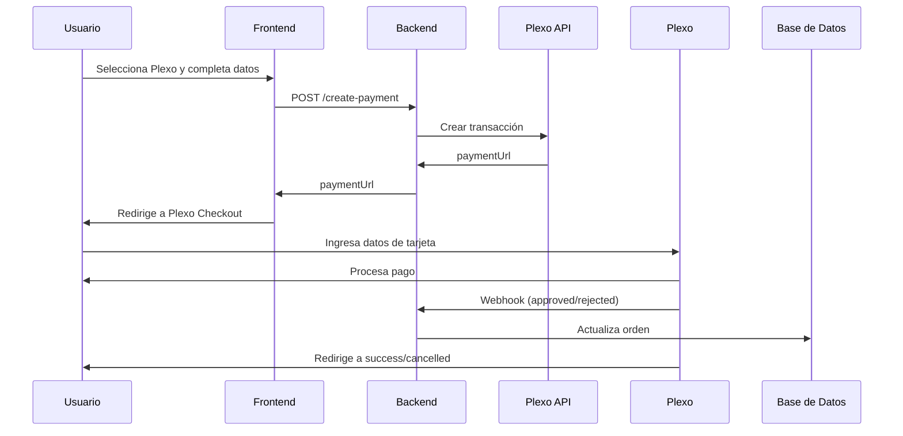

# Integración con Plexo (Uruguay) 🇺🇾

## 🎯 ¿Qué es Plexo?

**Plexo** (www.plexo.com.uy) es una pasarela de pagos uruguaya que permite procesar pagos con tarjetas de crédito y débito de forma segura y certificada (PCI DSS compliant).

### Características principales:

- ✅ **Tarjetas locales uruguayas**: Visa, Mastercard, OCA, Creditel
- ✅ **API REST moderna** y bien documentada
- ✅ **Tokenización** para pagos recurrentes
- ✅ **Webhooks** para notificaciones en tiempo real
- ✅ **Sandbox completo** para testing
- ✅ **Certificación PCI DSS** (seguridad garantizada)

---

## 📋 Configuración

### 1. Crear cuenta en Plexo

1. Regístrate en [www.plexo.com.uy](https://www.plexo.com.uy)
2. Completa el proceso de verificación (KYC)
3. Solicita credenciales de API

### 2. Obtener credenciales

Plexo te proveerá:

- **Client ID** (identificador de tu comercio)
- **Secret Key** (clave secreta para autenticación)

Puedes obtener credenciales de **Sandbox** y **Producción**.

### 3. Configurar variables de entorno

En tu proyecto de Supabase, ve a **Settings → Edge Functions → Secrets** y agrega:

```bash
PLEXO_CLIENT_ID=tu_client_id_aquí
PLEXO_SECRET_KEY=tu_secret_key_aquí
PLEXO_ENVIRONMENT=sandbox  # o "production" para producción
```

### 4. Verificar configuración

1. Ve al **Dashboard de Admin** en tu aplicación
2. Accede a la sección **"Integraciones de Pago"**
3. Verifica que **Plexo 🇺🇾** aparezca como "Configurado" ✅

---

## 🚀 Uso en el Checkout

### Cliente (Frontend)

Cuando un usuario selecciona **Plexo** en el checkout:

1. Completa sus datos (nombre, email, teléfono)
2. Hace clic en "Proceder al Pago"
3. Es redirigido a la página de pago de Plexo
4. Ingresa los datos de su tarjeta de forma segura
5. Plexo procesa el pago y redirige de vuelta a tu sitio

### Servidor (Backend)

El servidor crea una transacción de pago:

```typescript
POST /make-server-0dd48dc4/integrations/plexo/create-payment

Body:
{
  "amount": 150000,  // Monto en centavos (1500.00 UYU)
  "currency": "UYU",
  "orderId": "uuid-de-orden",
  "customer": {
    "name": "Juan Pérez",
    "email": "juan@example.com",
    "phone": "+598 99 123 456"
  },
  "items": [
    {
      "name": "Producto X",
      "quantity": 2,
      "price": 75000
    }
  ]
}

Response:
{
  "paymentId": "plexo-payment-id",
  "status": "pending",
  "paymentUrl": "https://checkout.plexo.com.uy/pay/...",
  "reference": "uuid-de-orden"
}
```

---

## 🔔 Webhooks de Plexo

Plexo envía notificaciones automáticas cuando cambia el estado de un pago.

### URL del webhook:

```
https://tu-proyecto.supabase.co/functions/v1/make-server-0dd48dc4/integrations/plexo/webhook
```

### Estados de pago:

- **pending**: Pago iniciado, esperando confirmación
- **approved**: Pago aprobado exitosamente ✅
- **rejected**: Pago rechazado (fondos insuficientes, tarjeta inválida, etc.) ❌
- **cancelled**: Pago cancelado por el usuario
- **refunded**: Pago reembolsado

### Configuración en Plexo:

1. Accede a tu panel de Plexo
2. Ve a **Configuración → Webhooks**
3. Agrega la URL del webhook
4. Selecciona los eventos: `payment.approved`, `payment.rejected`, `payment.refunded`

---

## 🧪 Testing en Sandbox

### Credenciales de prueba:

Plexo proporciona tarjetas de prueba para el ambiente de sandbox:

#### Tarjeta aprobada:
```
Número: 4111 1111 1111 1111
CVV: 123
Vencimiento: Cualquier fecha futura
Nombre: TEST APPROVED
```

#### Tarjeta rechazada:
```
Número: 4000 0000 0000 0002
CVV: 123
Vencimiento: Cualquier fecha futura
Nombre: TEST DECLINED
```

### Probar flujo completo:

1. Crea un producto de prueba en tu tienda
2. Agrégalo al carrito
3. Procede al checkout
4. Selecciona **Plexo 🇺🇾** como método de pago
5. Usa las tarjetas de prueba
6. Verifica que el webhook actualice el estado de la orden

---

## 🔐 Seguridad

### Buenas prácticas:

✅ **NUNCA expongas** `PLEXO_SECRET_KEY` en el frontend  
✅ **Valida** todos los webhooks para prevenir fraude  
✅ **Usa HTTPS** en todos los endpoints  
✅ **Registra** todos los eventos en logs para auditoría  
✅ **Tokeniza** tarjetas para pagos recurrentes (nunca guardes datos de tarjetas)

### Validación de webhooks:

Plexo firma los webhooks con un hash HMAC. Valida siempre la firma antes de procesar:

```typescript
// El servidor ya implementa esto automáticamente
// Verifica los logs para ver las notificaciones recibidas
```

---

## 🛠️ Endpoints disponibles

### 1. Crear pago

```typescript
POST /make-server-0dd48dc4/integrations/plexo/create-payment
```

Crea una nueva transacción de pago.

### 2. Consultar estado

```typescript
GET /make-server-0dd48dc4/integrations/plexo/payment-status/:paymentId
```

Obtiene el estado actual de un pago.

### 3. Webhook

```typescript
POST /make-server-0dd48dc4/integrations/plexo/webhook
```

Recibe notificaciones automáticas de Plexo.

---

## 📊 Flujo de pago completo



---

## 💰 Comisiones y costos

Las comisiones de Plexo varían según:

- Tipo de tarjeta (crédito/débito)
- Cuotas (1 pago o financiación)
- Volumen de transacciones mensuales

Consulta con tu ejecutivo comercial de Plexo para conocer las tarifas aplicables a tu negocio.

---

## 📚 Recursos adicionales

- 📖 [Documentación oficial de Plexo](https://www.plexo.com.uy/docs)
- 💬 [Soporte técnico](https://www.plexo.com.uy/soporte)
- 📧 Email: soporte@plexo.com.uy
- 📞 Teléfono: +598 2XXX XXXX (consultar con Plexo)

---

## ✅ Checklist de implementación

Antes de pasar a producción:

- [ ] Cuenta de Plexo verificada (KYC completado)
- [ ] Credenciales de producción obtenidas
- [ ] Variables de entorno configuradas (`PLEXO_ENVIRONMENT=production`)
- [ ] Webhook configurado en panel de Plexo
- [ ] Pruebas completas en sandbox
- [ ] Flujo de reembolsos probado
- [ ] Manejo de errores implementado
- [ ] Logs y monitoreo configurados
- [ ] Términos y condiciones actualizados

---

## 🆘 Solución de problemas

### Error: "Plexo not configured"

**Causa**: Las variables de entorno no están configuradas correctamente.

**Solución**:
1. Verifica que `PLEXO_CLIENT_ID` y `PLEXO_SECRET_KEY` estén en Supabase Secrets
2. Reinicia la Edge Function
3. Recarga el dashboard para verificar

### Error: "Payment rejected"

**Causa**: La tarjeta fue rechazada por el banco emisor.

**Posibles razones**:
- Fondos insuficientes
- Tarjeta vencida o inválida
- Límite de compras excedido
- Bloqueo de seguridad

**Solución**: El usuario debe contactar a su banco o probar con otra tarjeta.

### Webhook no se recibe

**Causa**: URL del webhook mal configurada o bloqueada.

**Solución**:
1. Verifica la URL en el panel de Plexo
2. Asegúrate de que la Edge Function esté corriendo
3. Revisa los logs de Supabase para ver si hay errores
4. Prueba con herramientas como [webhook.site](https://webhook.site) para debuggear

---

## 🎉 ¡Listo!

Tu integración con Plexo está completa. Ahora puedes procesar pagos con tarjetas uruguayas de forma segura y profesional.

Para soporte adicional, consulta la documentación oficial o contacta al equipo de Plexo.
